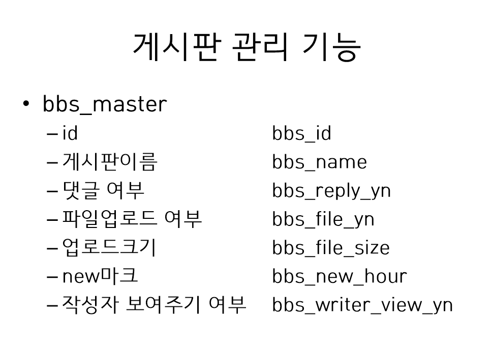
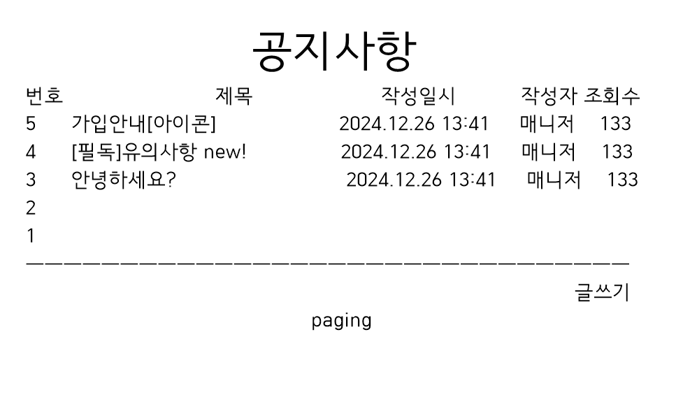
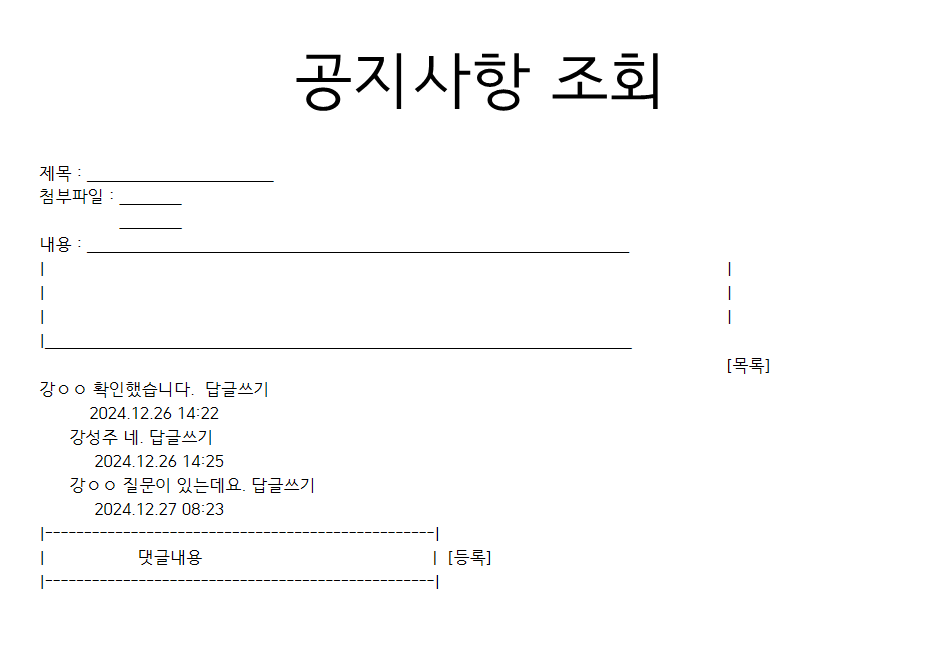
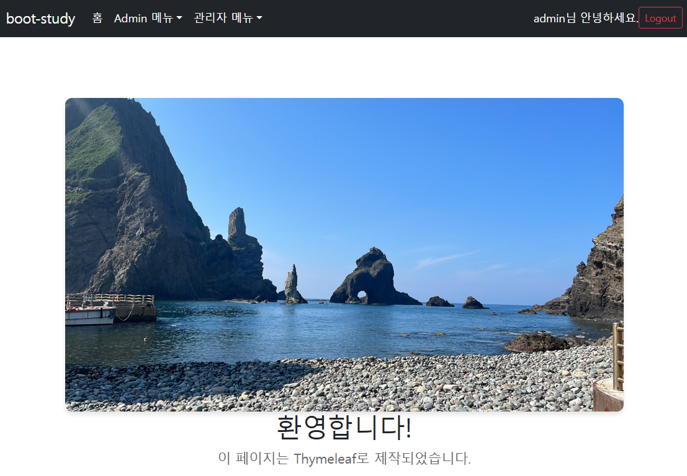
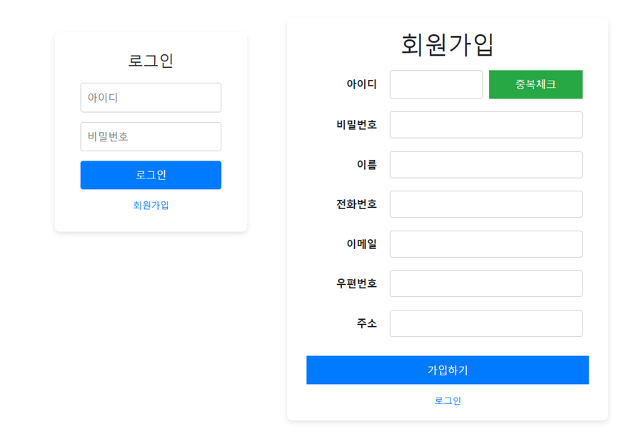
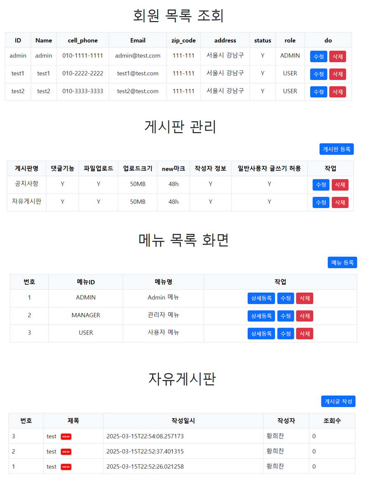
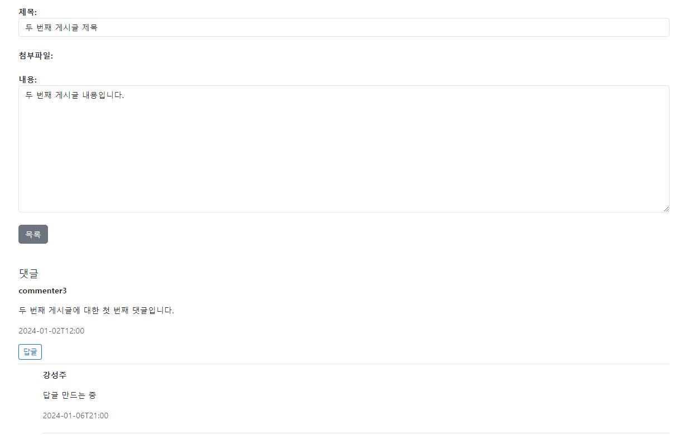

# Springboot Study (개인학습)

# 기획의도
### 1. Springboot를 이해하고 Backend 서비스 개발을 학습
### 2. Spring Seucity 적용
### 3. Spring JDBC 적용 - MyBatis
### 4. Spring JPA 적용
### 5. Application Build 환경 구성 (Jenkins)

# 목표 시스템
### - 회원관리, 로그인(인증) 및 권한 관리
### - 권한 및 메뉴 관리
### - 게시판 관리 (게시판 자동 생성 및 댓글기능 구현)

# 설계
### PPT를 활용하여 DB설계 및 화면설계




# Screen shot

### [ Home 화면 ]


### [ 로그인 / 회원가입 ]


### [ 회원관리 / 게시판관리 / 메뉴관리 / 자유게시판 ]


### [ 게시글 조회 ]


## SpringSecurity
* .loginProcessingUrl("/login/member_login") ----> loadUserByUsername()
```javascript
<!-- 기존코드 -->
<div class="login-container">
    <h1>로그인</h1>
    <form id="loginForm" th:action="@{/member_main.page}" method="post">
        <input type="text" id="id" name="id" placeholder="아이디" required />
        <input type="password" id="passwd" name="passwd" placeholder="비밀번호" required />
        <button type="button" th:onclick="chkLogin()">로그인</button>
    </form>
    <a th:href="@{/login/member_register.page}">회원가입</a>
</div>

<!-- SpringSecurity 쓰면서바뀐 코드 -->
<div class="login-container">
    <h1>로그인</h1>
    <form id="loginForm" th:action="@{/login/member_login}" method="post">
        <input type="text" id="id" name="id" placeholder="아이디" required />
        <input type="password" id="passwd" name="passwd" placeholder="비밀번호" required />
        <button type="button" th:onclick="chkLogin()">로그인</button>
    </form>
    <a th:href="@{/login/member_register.page}">회원가입</a>
</div>
```
### [ 기존 로직 / 바뀐 로직 설명 ]
* th:action="@{/member_main.page}" --> th:action="@{/login/member_login}"
* 기존 /member_main.page는 로그인 버튼(chkLogin())누르면 ajax 이용해서 
  ```java
  memberService.selectMemberOne(memberVO);
  ```
  호출해서 회원 조회 sql 호출해서 status 값이 Y인지 N인지 확인 후 N이면 이메일 인증값에 대해 isStatusN return, Y면 이메일 인증값에 대해
  ```java
  memberService.loginMember(memberVO);
  ```
  로그인 호출 하여 아이디, 비밀번호 들고가서 계정이 맞는지 확인 후, loginForm.submit()하여 action에 위치한 member_main.page로 화면이동 하는 로직이었음.
* **
* 바뀐 /login/member_login는 
  ```java
  .formLogin(formLogin -> formLogin
          .loginPage("/login/member_login.page")
          .loginProcessingUrl("/login/member_login")
          .usernameParameter("id")
          .passwordParameter("passwd")
          .defaultSuccessUrl("/member_main.page")
          .permitAll()
  )
  ```
  (Config설정에 .formLogin()에서 셋팅을 먼저 한다.)
  Config설정에 셋팅이 되어있으니 loginForm.submit() 했을 때 /login/member_login(로그인 처리 URL) 찾아 security 설정 되어있는 곳으로 연결됌.
  id를 loadUserByUsername() 여기로 보내서
  ```java
  memberMapper.selectMemberPasswd(memberVO);
  ```
  그 아이디의 passwd, role를 조회해오고 User.builder() 하면
  UserDetails 객체를 생성하고 이 객체는 SpringSecurity가 내부적으로 사용자 인증 및 권한 관리를 처리할 때 사용 됌.
* **
* **
* 게시글 등록 권한 기능
  ```java
  .requestMatchers("/bbs/create_bbs.page/**").hasAnyRole("ADMIN") 
  ```
  * 이렇게 하니까 ADMIN만 접근 가능해서 USER로 로그인 후, 게시글 등록 시도 시 자유게시판이어도 403에러가 뜸.
  * (FRONT에서 버튼 안 보이게 해놨지만, URL로 접근 가능성 있으니 방지해야함)

* 해결방법
  * service단에서 권한 체크 + checkModel()에 권한 검사 추가
    ```java
    Authentication authentication = SecurityContextHolder.getContext().getAuthentication();
    String username = authentication.getName();
  
    // 🔥 권한 체크
    if (!bbsMasterService.canUserWrite(bbsId, username)) {
        throw new AccessDeniedException("게시글 작성 권한이 없습니다.");
    }
  
    public boolean canUserWrite(String bbsId, String username) {
      // 공지사항 게시판 ID 목록
      List<String> noticeBoards = List.of("BBS001");
  
      // 자유게시판이면 true 반환 (누구나 작성 가능)
      if (!noticeBoards.contains(bbsId)) {
          return true;
      }

      // 공지사항이면 관리자 권한 체크
      Authentication authentication = SecurityContextHolder.getContext().getAuthentication();
      return authentication.getAuthorities().stream()
              .anyMatch(grantedAuthority -> grantedAuthority.getAuthority().equals("ROLE_ADMIN"));
    }
    ```


## JPA
1. dependency 추가
2. application.properties 추가
* vo랑 model이랑 비슷한데 다름.
* jpa에서 model을 정의할 때는 실제 테이블인지 명시해주는 게 있음.
* dialect는 방언이라는 뜻. db가 다양하니까 내가 선택한 db로 하면 됌.

* @entity 는 객체라는 뜻.
* @Table은 DB 테이블 이름이랑 다를 때 지정.

* @GeneratedValue(strategy = GenerationType.IDENTITY) 자동증가
* @Column(nullable = false, unique = true)    //not null, unique
* 생성자를 꼭 만들어줘야 함.

* Repository
* jpaRepository에서 기능들을 함수로 구현해놔있음. extends 해서 쓰면 됌.
* postgre문법에 맞는 문장을 자동으로 만들어줌

```java
Role findByRoleName (String roleName);                      ==> where name = ${name}
Role findByRoleNameContains (String roleName);              ==> where name LIKE ${NAME} || '%'
Role findByRoleNameContainsIgnoreCase (String roleName);    ==> where upper(name) LIKE upper (${NAME}) || '%'
```

```shell
controller -> service -> mapper -> sql                    --> 기존
                      -> reposotory -> model -> Dialect   --> jpa
```
* 테이블 생성하지 않아도 실행하면 테이블 만들어져 있음

* 연관관계
  * @ManyToOne
  * @OneToMany
    * 계속해서 순환참조 에러 남.. tostring()이 무한루프를 돌아서 그랬던 거였음.. override해서 따로 해주니까 됌.
    * 순환참조 에러 시 @JsonIgnore, @JsonIdentityInfo 해결방법이 있음.
  * JsonManagedReference를 상위에 입력하기 그러면 하위 데이터도 같이 select해옴
    * MenuDetail에서 SELECT문이 두 번 날라감.(Menu까지)
    * 한 줄로 하기 위해서 JPQL을 이용해서 @Query()로 커스텀 할 수 있음. JOIN FETCH 쓰기
    * [LEFT [OUTER] | INNER] JOIN FETCH 조인경로
  * @ManyToMany
    * JsonManagedReference, JsonBackReference안 먹힘.
    * JsonIdentityInfo 다대다관계에 적합.
    * dialect
      * JPA는 관계를 주로 신경 씀.
      * mapper할 때는 delete -> insert인데 JPA는 UPDATE일까, DELETE->INSERT일까 했는데 후자였음.
      * 요청 포맷만 맞춰주면 잘 저장해줌.
      ```shell
          const role = {};
          role.id = '[[${role.id}]]';
          role.roleId = '[[${role.roleId}]]';
          role.roleName = '[[${role.roleName}]]';
          role.menuList = assignedMenus;
          console.log(role);
      
          $.ajax({
          url: '/role/save',
          type: 'PUT',
          contentType: 'application/json',
          data: JSON.stringify(role),
          success: function(result) {
          if (result.code === "Y") {
          alert("저장이 완료되었습니다.");
          } else {
          alert("저장에 실패했습니다. 다시 시도해주세요.");
          }
          },
          error: function() {
          alert("저장 중 오류가 발생했습니다.");
          }
          });
        ```


## Jenkins
* jenkins 설치
```shell
startup.sh 작성
nohup java -jar jenkins.war --httpPort=8081 &
```
* chmod 700 startup.sh --> 실행 권한 나에게만 부여
* jenkins 들어가서 설정하기
  * cat /home/ubuntu/jenkins/webapps/secrets/initialAdminPassword 비밀번호 입력
  * maven plugin 설치, 수동설정
    * Jenkins관리 - Tools에 있음.
  * credentials 적용(?)
  * 새로운 item - pipeline 만들기
    * shell script 쓰기
      * ```shell
        pipeline {
          agent any
      
          tools {
            maven 'maven399' --> 내가 설정한 이름
          }
      
          stages {
            stage('Git Pull') {
              steps {
                echo '========= Git Pull ========'
                git branch: 'main', credentialsId: 'gitadmin',
                url: 'https://github.com/aksk179/msa-member.git'
              }
            }
            stage('Maven_Build') {
              steps {
                echo '======== Maven_Build ========'
                sh '''
                mvn clean package -DskipTests
                ls -l
                '''
              }
            }
          }
        }
        ```
* 만든 pipeline - 구성에 들어가면 됌.
* 지금 빌드


### SQL
* 게시글 답글 기능
* recursive() 상-하위 관계별로 조회해오는 sql문 이용.
  ```shell
  WITH RECURSIVE find_cmt(bbs_id, bbs_no, bbs_cmt_seq, bbs_cmt_writer, bbs_cmt_wtime, bbs_comment, bbs_cmt_upseq)
        AS (
        -- START_QUERY: 최상위 댓글 찾기
        SELECT bbs_id, bbs_no, bbs_cmt_seq, bbs_cmt_writer, bbs_cmt_wtime, bbs_comment, bbs_cmt_upseq
        FROM bbs_comment
        WHERE 1=1
        AND bbs_id = #{bbsId}
        AND bbs_no = #{bbsNo}
        AND bbs_cmt_upseq = 0

        UNION ALL

        -- REPEAT_QUERY: 답글 찾기
        SELECT bc.bbs_id, bc.bbs_no, bc.bbs_cmt_seq, bc.bbs_cmt_writer, bc.bbs_cmt_wtime, bc.bbs_comment, bc.bbs_cmt_upseq
        FROM find_cmt fc
        INNER JOIN bbs_comment bc
        ON fc.bbs_cmt_seq = bc.bbs_cmt_upseq -- 부모 댓글-답글 관계
        AND bc.bbs_id = #{bbsId}                -- 동일 게시글
        AND bc.bbs_no = #{bbsNo}                   -- 동일 게시글 번호
        )
        -- VIEW_QUERY
        SELECT *
        FROM find_cmt
        ORDER BY
        CASE
        WHEN bbs_cmt_upseq = 0 THEN bbs_cmt_seq -- 댓글은 그대로 시간순으로 정렬
        ELSE bbs_cmt_upseq                     -- 답글은 부모 댓글 바로 아래로 정렬
        END,
        bbs_cmt_seq
  ```


## 참고
* thymleaf에서는 문자열 데이터를 이벤트 핸들러 속성에 직접 사용하려고 하면 보안상의 이유로 제한 발생. 숫자나 boolean 값만 신뢰함.
  * 해결방법 => data-* 속성을 사용.
  ```shell
  <a class="btn btn-sm btn-danger" th:attr="data-bbs-id=${bbs.bbsId}" onclick="deleteBbsMaster(this)">삭제</a>
  ```
  
### dynamicPage
```java
@RequestMapping(value = "/{dirPath}/{pageName}.page")
    public String dynamicPage(@PathVariable("dirPath") String dirPath, @PathVariable("pageName") String pageName, Model model) {
        checkModel(pageName, "", model);
        return "/" + dirPath + "/" + pageName;
    }
```

* 게시글 조회 할 때 sql에서 join해서 가져오면 중복됌.(ex) 첨부파일이 두 개, 댓글이 두 개면 총 네 개가 조회되어버림.)
* 각자 조회해오는 service를 만들고, controller단에서 조합해서 화면으로 던져주기
* 잘 안 될때는 일단 코딩해보고 중복되는 부분을 변수화하고, 하나로 합치기. 하드코딩X!

### 통신
```java
@ModelAttribute MemberVO memberVO;
@RequestParam Map<String, String> param;
```
@ModelAttribute를 쓰면 내가 만든 VO에 바로 담을 수 있다.
@RequestParam을 쓰면 param에서 뽑아서 VO에 다시 담아서 Service단으로 넘겨야 함.

* 데이터만 통신할 시에는 RestController 이용.

* json data 통신의 경우
  * @ResponseBody, @RequestBody 사용.

* form data 통신의 경우
  * 낱개로 받을 때
    * @RequestParam("변수명") String [변수명]

  * 여러개 받을 때
    * @RequestParam Map<String, String> param

* DTO, VO를 따로 쓸 때가 있음.
  * DTO : 클라이언트-서버 단 통신 시 이용
  * VO : DB와의 통신 시 이용
    * 이 둘의 변수가 같을 시 자동매핑해주는 함수도 있음. 직접 구현도 가능.
